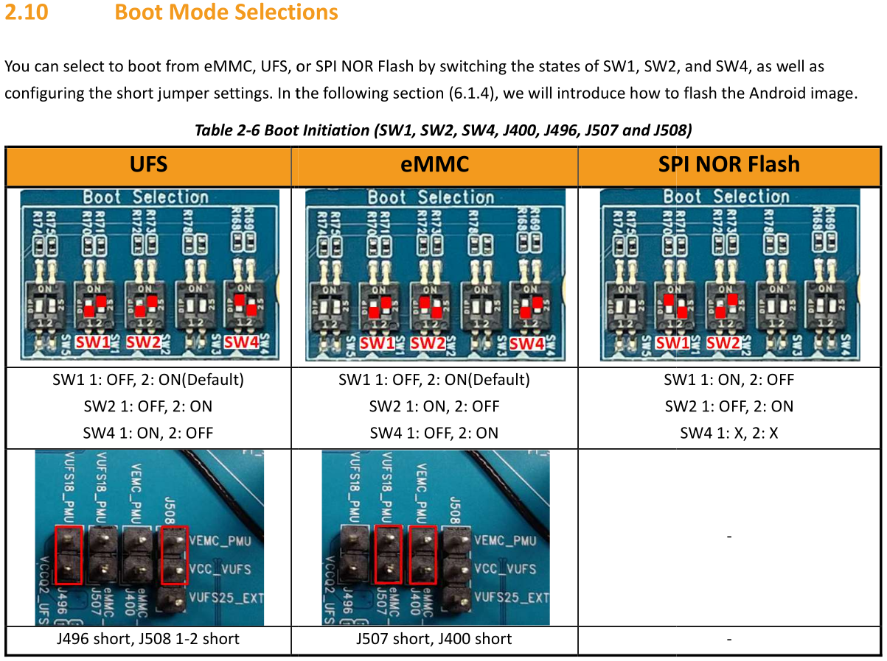

# genio-image

[](https://github.com/canonical/genio-image/actions/workflows/build.yml)
[](https://github.com/canonical/genio-image/actions/workflows/checkbox-test.yml)

[](https://github.com/canonical/genio-image/actions/workflows/build-boot.yml)

[](https://github.com/canonical/genio-image/actions/workflows/build-generic.yml)

# Available Automation

For building locally, there is a `scripts/build.sh` script in this repository.

There are also Github Actions in the `.github` directory. The `build.yaml`
file schedules builds of the Genio images daily, and is the ultimate authority
on how to build the images.

# Boot Modes

## All Boards

All boards can boot from eMMC and this is the image type which is built by
default.

## G1200 eMMC/UFS Selection

The G1200 can boot from UFS or eMMC. To boot from UFS, simply flash a `-ufs`
image and associated boot artifacts onto the board. Before flashing the UFS
image, erase the eMMC device with

```
$ genio-flash erase-emmc
```

To ensure the boot ROM does not try to boot any stale image that was
previously there.

## G720/G520 eMMC/UFS Selection

HW switchs configuration is required to select boot from UFS and eMMC.



# Building Images

## Prerequisite

Your login user must have access to run arbitrary commands as root. This is
required to install snaps and debs for the build environment, and also to run
the ubuntu-image tool.

The `ubuntu-image` tool is required to create pre-installed disk images of
Ubuntu:

```
$ snap install ubuntu-image
```

Ensure that the `qemu-user-static` pacakge is installed on the build host so
that the build can run Arm binaries to configure the image. The Android
utility `img2simg` is also needed. This comes from the
`android-sdk-libsparse-utils package`.

```
$ apt install qemu-user-static android-sdk-libsparse-utils
```

Ensure the `genio-tools` snap is installed on the Ubuntu host. The snap
cannot currently configure udev rules, so a manual post-install step is
needed:

```
$ sudo snap install genio-tools
$ eval "$(snap run genio-tools.udev-script)"
```

More information about these steps is available with `snap info genio-tools`

## Including PPA Packages When Building Manually

By default, the `classic/*/ubuntu-*-baoshan.yaml` files have the `extra-ppas` section set to an empty list.

If you want to include PPA packages when building images manually, you need to modify the corresponding YAML file(s) and provide a valid PPA token.

Example configuration:

```YAML
customization:
  extra-ppas:
    - name: baoshan-ppa/baoshan-updates
      auth: <YOUR_PPA_TOKEN>
      fingerprint: 703A0CD379B768B77C1BA91FDD3EC3B6C6D209D1
      keep-enabled: false
```

**Note:**
Make sure to replace <YOUR_PPA_TOKEN> with a valid token.
Please contact the project administrator to request access to the required PPA token.

Obtain an access tokens for Baoshan PPAs:

- [baoshen-updates](https://launchpad.net/~baoshan-ppa/+archive/ubuntu/baoshan-updates/+subscriptions)
- [baoshen-proposed](https://launchpad.net/~baoshan-ppa/+archive/ubuntu/baoshan-proposed/+subscriptions)

The token will be in the form `username:access-key`. Update the YAML
files with the access token so the build will be able to fetch required
artifacts.

## Location of images

After building the images with the code snippets in this readme, they will
appear in the current directory next to the YAML files. The important files
are `ubuntu.img` and `ubuntu.json`.

If using the `scripts/build.sh` script then an output directory is created for the
build to contain all the files.

# Build eMMC Image for G350/G510/G700/G1200

## To build desktop image
```
$ sudo ubuntu-image classic classic/noble/ubuntu-desktop-baoshan.yaml
```

## To build server image
```
$ sudo ubuntu-image classic classic/noble/ubuntu-server-baoshan.yaml
```

# Build UFS image for G1200

## To build desktop image
```
$ sudo ubuntu-image classic --sector-size=4096 classic/noble/ubuntu-desktop-baoshan.yaml
```

## To build server image
```
$ sudo ubuntu-image classic --sector-size=4096 classic/noble/ubuntu-server-baoshan.yaml
```

# Using the images

First follow the earlier build steps to create a `ubuntu.img` and
`ubuntu.json` file.

After that, we need to make the image into a sparse image with the `img2simg`
program. This will allow the `genio-flash` tool to actually write it. If this
step is omitted then the user will receive a strange error about sector sizes
being incorrect.

```
$ img2simg ubuntu.img ubuntu-sparse.img
```

Obtain a copy of the boot assets for the desired board from [OEM
Share](https://oem-share.canonical.com/partners/baoshan/share/).  Obtain the
correct secure/non-secure boot assets depending on the e-fuse configuration of
the board. Most users will want the non-secure version.

Create a directory to hold all of the files and then unpack the boot assets
into it, stripping a directory level so that all the files are just in the
unpack directory:

```
$ mkdir unpack
$ tar --strip-components=1 -C unpack -xf genio-gXXX-*-boot-assets-YYYYMMDD-*.tar.xz
$ cd unpack
$ ln ../ubuntu-sparse.img ubuntu.img
$ ln ../ubuntu.json .
```

We created hard links to the output of the image build just to preserve space
rather than copying the files.

Please note that the genio boards do not contain a MAC address by default.
To set a consistent one, edit the `u-boot-initial-env` file and add a line
like the one below. Remember to set a unique, valid MAC address that is not
otherwise in use on the local network.

```
ethaddr=00:55:7b:b5:7d:f7
```

Once the MAC address has been set, it is possible to flash the boot firmware
on the board using the `genio-flash` tool. The example below is for eMMC
flashing. Flashing UFS is left as an exercise to the reader of the Mediatek
documentation.

```
$ genio-flash mmc0boot0 mmc0boot1 bootloaders
$ genio-flash
```

And wait. To re-flash the boot firmware after changing the
`u-boot-initial-env` file (e.g. to change the MAC address or display
configuration) simply re-run the first command.

G1200 boards cannot be controlled by the `genio-flash` tool. When programming
a G1200 board, the user needs to manually press buttons. The buttons are
located between the two HDMI connectors on the right of the board. Hold the
`Download` (bottom) button while pressing and releasing the `Reset` (second
from top) button. Wait for the `genio-flash` tool to say `waiting for any
device` and then release the download button.  G510 and G700 boards, simply
run the commands and wait.

# Dump firmware

```
# ./scripts/dump-firmware.sh "<raw image>" "<output firmware.vfat>" "[sector size]"
$ ./scripts/dump-firmware.sh out/ubuntu.img firmware.vfat 4096
```

# Updating Image Definitions (Advanced)

- **Warning**: Please be aware that using this script will remove all comments and reformat the YAML file upon saving.

Make sure you define the correct token for PPAs:

```
$ SECRET_VARIABLE="your_launchpad_username:your_access_key"
$ IMAGE_DEFINITION_FILE="classic/noble/ubuntu-desktop-baoshan.yaml"
```

### To add a new PPA

```
$ ./scripts/patch-image-definition.py customization.extra-ppas add \
    --name "new-ppa/stable" \
    --auth "${SECRET_VARIABLE}" \
    --fingerprint "FINGERPRINT_VALUE_XXX" \
    --keep-enabled true \
    "${IMAGE_DEFINITION_FILE}"
```

### To remove a PPA

```
$ ./scripts/patch-image-definition.py customization.extra-ppas remove \
    --name "baoshan-ppa/baoshan-updates" \
    "${IMAGE_DEFINITION_FILE}"
```

### To update a PPA's fields

```
$ ./scripts/patch-image-definition.py customization.extra-ppas update \
    --name "baoshan-ppa/baoshan-updates" \
    --auth "${SECRET_VARIABLE}" \
    "${IMAGE_DEFINITION_FILE}"
```

### To update other field's value

You can also update the value of a specific field in the YAML, such as the `rootfs.mirror` URL.

```
$ ./scripts/patch-image-definition.py rootfs.mirror update \
    --value "http://mirrors.ustc.edu.cn/ubuntu-ports/" \
    "${IMAGE_DEFINITION_FILE}"
```
